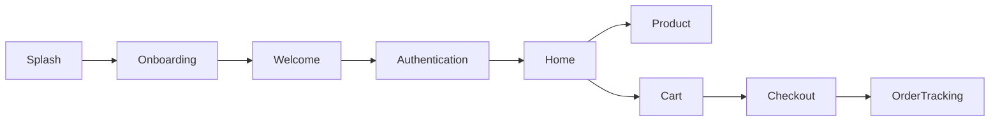

# Fruits App 🍎

A comprehensive Flutter application for a fruits and vegetables marketplace, featuring a modern UI, responsive design, and a robust feature set.

## 🌟 Overview

The Fruits App provides a seamless shopping experience with a focus on usability and aesthetics. Key capabilities include:

### 🔐 Authentication & Onboarding

- **Complete Auth Flow**: Sign In, Sign Up, Phone Verification, and OTP Verification.
- **Onboarding**: Interactive 3-page onboarding sequence.
- **Security**: Secure input handling with `pin_code_fields`.

### 🏠 Home & Discovery

- **Dynamic Home Screen**: Carousel banners, category browsing, and featured sellers.
- **Smart Search**: Filter and search functionality.
- **Seller Profiles**: Detailed seller pages with ratings, delivery info, and product catalogs.

### 🛍️ Shopping Experience

- **Product Details**: Rich product views with expandable sections for weight and addons.
- **Cart Management**: Easy-to-use basket with cost breakdown.
- **Checkout**: Multi-step checkout process (Address, Payment, Confirmation).
- **Address Management**: Add, edit, and select delivery addresses.

### 📦 Order Management (New!)

- **Order History**: View past and current orders.
- **Order Tracking**: Real-time vertical timeline tracking for active orders.
- **Status Updates**: Visual indicators for Delivered, Out for Delivery, Shipped, etc.

### 👤 Profile & Support (New!)

- **Profile Management**: Edit personal details and password.
- **Language Support**: Switch between Arabic and English.
- **Support Center**: Contact support via form or social media.
- **Legal**: View Terms & Conditions and other policies.

---

## 🛠️ Technology Stack

- **Framework**: Flutter
- **Design**: `flutter_screenutil` (Responsive), `google_fonts`, `flutter_svg`
- **Navigation**: `google_nav_bar`
- **UI Components**: `carousel_slider`, `smooth_page_indicator`, `easy_stepper`, `timeline_tile`
- **Forms**: `intl_phone_field`, `pin_code_fields`

---

## 📂 Project Structure

The project follows a **Feature-First Architecture**, ensuring separation of concerns and scalability.

### Core Navigation Flow

### Key Directories

- `lib/core`: Shared utilities, constants (`AppColors`, `AppTextStrings`), and common widgets.
- `lib/features`: Feature-specific modules (Auth, Home, Basket, Orders, etc.).

---

## 🚀 Recent Updates & Changelog

### 📅 November 22, 2025 - Profile & Support Features

**New Features:**

- **Profile Screen**: "More" menu with navigation to Profile, Orders, Favorites, Language, Support, etc.
- **Edit Profile**: Screen to update user details (Name, Phone, Password).
- **Language Dialog**: Dialog to switch between Arabic and English.
- **Contact Us**: Support screen with message form and social media links.
- **Terms & Conditions**: Screen displaying legal terms.

**Technical Updates:**

- **Named Routes**: Implemented named routes for all Profile-related screens in `AppRoute`.
- **Refactoring**:
  - `DropMenu`: Made reusable with external parameters.
  - `CustomInputField`: Added `maxLines` support for multiline input.
- **Resources**: Updated `AppTextStrings` and `AppImagesStrings` with new assets.

### 📅 November 20, 2025 - Order Tracking Feature

**New Features:**

- **Order Tracking Screen**: Dedicated screen with a vertical timeline using `timeline_tile`.
- **Order Info**: Detailed view of order code, items, price, and payment method.
- **Visuals**: Custom "Success Green" color for active tracking steps.

**UI/UX Improvements:**

- **Order Card**: Added navigation arrow and simplified SVG usage.
- **Styling**: Enhanced typography and spacing across order screens.

### 📅 November 19, 2025 - Checkout & Payment

- **Payment Screen**: Added coupon input, payment options, and order summary.
- **Address Selector**: Refactored address selection with new UI components.
- **Stepper**: Integrated `CheckoutStepper` for clear progress indication.

### 📅 November 18, 2025 - Address & UI Refactor

- **Address Components**: Split into `AddressItem`, `AddressForm`, and `AddAddressDialog`.
- **Validation**: Improved form validation and error handling.
- **Theming**: Standardized button styles and text themes.

### 📅 November 17, 2025 - Basket & Calendar

- **Basket Summary**: Refactored into `BasketCostRow` and `BasketSummaryFooter`.
- **Calendar**: Created reusable `CalendarSelector` with "Now" and date selection modes.

---

## 📝 Best Practices & Guidelines

### Constants Management

We strictly use centralized constants to maintain consistency.

- **Colors**: `AppColors.primaryGreen`
- **Dimensions**: `AppHeight.h20`, `AppWidth.w15`, `AppSizes.sp16`
- **Strings**: `AppTextStrings.submit`

### Asset Handling

- **Images**: Accessed via `AppImagesStrings`.
- **SVGs**: Rendered using `SvgPicture.asset`.

---

## 🔧 Troubleshooting

- **SVG Issues**: Verify `flutter_svg` dependency and asset paths in `pubspec.yaml`.
- **Layout Issues**: Ensure `ScreenUtilInit` is properly configured in `main.dart`.
- **Performance**: Use `RepaintBoundary` for complex animations (e.g., Timer).

---

_Built with ❤️ using Flutter_
