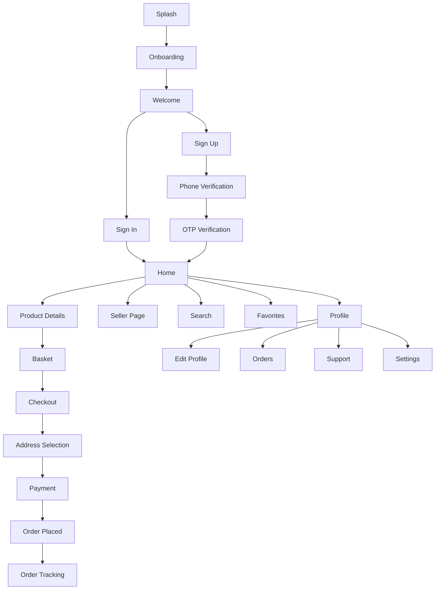

# Fruits App 🍎🥗

A comprehensive Flutter-based e-commerce marketplace for fresh fruits and vegetables, featuring a modern, responsive design with complete shopping functionality across mobile, tablet, and desktop platforms.

---

## 📋 Table of Contents

- [Overview](#-overview)
- [Features](#-features)
- [Screenshots](#-screenshots)
- [Technology Stack](#️-technology-stack)
- [Architecture](#-architecture)
- [Getting Started](#-getting-started)
- [Project Structure](#-project-structure)
- [Responsive Design](#-responsive-design)
- [Development Guidelines](#-development-guidelines)
- [Recent Updates](#-recent-updates)
- [Contributing](#-contributing)

---

## 🌟 Overview

Fruits App is a full-featured e-commerce application built with Flutter, providing a seamless shopping experience for fresh produce. The app features a complete user journey from onboarding to order tracking, with support for multiple device types and screen sizes.

**Key Highlights:**

- 📱 Fully responsive design (Mobile, Tablet, Desktop)
- 🛍️ Complete shopping flow with cart and checkout
- 📦 Real-time order tracking
- 👤 User profile management
- ❤️ Favorites and wishlist functionality
- 🌐 Multi-language support (Arabic, English)
- 🎨 Modern UI with custom design system

---

## ✨ Features

### 🔐 Authentication & Onboarding

**Splash Screen**

- Animated logo and branding
- Automatic navigation to onboarding or home based on user state

**Onboarding**

- Interactive 3-page carousel introduction
- Skip functionality
- Smooth page transitions

**Authentication Flow**

- Welcome screen with Sign In / Sign Up options
- Sign In with email and password
- Sign Up with full user details
- Phone number verification with international format
- OTP (One-Time Password) verification using PIN code input
- Password reset functionality

### 🏠 Home & Discovery

**Home Screen**

- Dynamic promotional carousel banners
- Category browsing with icons
- Featured sellers section
- Product search functionality
- Bottom navigation (Home, Favorites, Basket, More)
- Adaptive layouts for different screen sizes

**Search & Filtering**

- Product search by name
- Category-based filtering
- Sort by price, popularity, rating

### 🛍️ Shopping Experience

**Product Details**

- High-quality product images
- Detailed descriptions
- Price and discount information
- Weight/quantity selector with expandable options
- Add-ons and extras selection
- Related products suggestions
- Add to cart / Add to favorites buttons
- Desktop layout: Two-column (image | details)

**Seller Pages**

- Seller profile with rating and reviews
- Delivery information
- Operating hours
- Product catalog from seller
- Contact seller options
- Desktop: Sidebar info with product grid

### 🛒 Cart & Checkout

**Shopping Basket**

- Cart items with quantity adjustment
- Remove items functionality
- Cost breakdown (subtotal, delivery, discount)
- Total price calculation
- Delivery date/time selector with calendar
- Desktop: Sidebar summary panel

**Checkout Process**

- Multi-step checkout with progress stepper:
  1. **Address Selection**: Choose or add delivery address
  2. **Payment Method**: Select payment option (Cash, Card, etc.)
  3. **Order Confirmation**: Review and place order
- Address management (Add, Edit, Select)
- Coupon/Promo code input
- Order summary with itemized costs

### 📦 Orders & Tracking

**Orders List**

- View all past and current orders
- Order cards with status, date, and total
- Filter by order status
- Navigate to order details

**Order Tracking**

- Real-time order status updates
- Vertical timeline with visual indicators:
  - Order Placed ✓
  - Confirmed ✓
  - Shipped 📦
  - Out for Delivery 🚚
  - Delivered ✅
- Order details (code, items, price, payment method)
- Estimated delivery time
- Desktop: Two-column layout (timeline | info)

### ❤️ Favorites

**Favorites List**

- Dedicated screen for saved products
- Product cards with store information
- Quick remove from favorites
- Navigate to product details
- Desktop: 2-column grid layout

### 👤 Profile & Settings

**Profile Screen**

- User information display
- Profile menu with navigation options:
  - Edit Profile
  - My Orders
  - Favorites
  - Language Settings
  - Contact Support
  - Terms & Conditions
  - Logout

**Edit Profile**

- Update personal details (Name, Phone)
- Change password
- Profile picture management
- Form validation
- Desktop: Centered form layout

**Language Settings**

- Switch between Arabic and English
- Dialog-based language selector
- Persistent language preference

**Contact Support**

- Message form for inquiries
- Social media links (Facebook, Twitter, Instagram)
- Contact information
- Desktop: Centered form

**Terms & Conditions**

- Legal terms display
- Scrollable content
- Desktop: Centered content with max-width

---

## 📸 Screenshots

> _Add screenshots here showcasing different features and responsive layouts_

---

## 🛠️ Technology Stack

### **Framework & Language**

- **Flutter** (Latest stable version)
- **Dart**

### **UI & Design**

- `flutter_screenutil` - Responsive sizing and scaling
- `google_fonts` - Custom typography
- `flutter_svg` - SVG image rendering
- `carousel_slider` - Image carousels
- `smooth_page_indicator` - Page indicators

### **Navigation & State**

- `google_nav_bar` - Animated bottom navigation
- Named routes for navigation management

### **Forms & Input**

- `intl_phone_field` - International phone number input
- `pin_code_fields` - OTP/PIN code input
- Custom input fields with validation

### **UI Components**

- `easy_stepper` - Checkout progress stepper
- `timeline_tile` - Order tracking timeline
- Custom reusable widgets

---

## 🏗️ Architecture

### **Feature-First Architecture**

The project follows a feature-first modular architecture, ensuring separation of concerns, scalability, and maintainability.

```
lib/
├── core/                          # Shared utilities and widgets
│   ├── style/                     # App-wide styling
│   │   ├── spacing/              # Spacing utilities
│   │   └── theme/                # Theme configuration
│   ├── utils/                     # Utilities and constants
│   │   ├── constant/             # App constants
│   │   │   ├── app_colors.dart
│   │   │   ├── app_text_strings.dart
│   │   │   ├── app_images_strings.dart
│   │   │   ├── app_height.dart
│   │   │   ├── app_width.dart
│   │   │   └── app_sizes.dart
│   │   └── routes/               # Named routes
│   └── widget/                    # Reusable widgets
│       ├── adaptive_layout/      # Responsive layout widgets
│       ├── button/               # Custom buttons
│       ├── common/               # Common UI components
│       └── input/                # Input fields
│
├── features/                      # Feature modules
│   ├── splash/                   # Splash screen
│   ├── onboarding/               # Onboarding flow
│   ├── auth/                     # Authentication
│   │   └── modules/
│   │       ├── welcome/
│   │       ├── sign_in/
│   │       ├── sign_up/
│   │       ├── phone_verification/
│   │       └── otp_verification/
│   ├── home/                     # Home screen
│   ├── product/                  # Product details
│   ├── seller/                   # Seller profiles
│   ├── basket/                   # Shopping cart
│   ├── checkout/                 # Checkout process
│   ├── orders/                   # Orders & tracking
│   ├── favourite/                # Favorites
│   └── profile/                  # User profile & settings
│
└── main.dart                     # App entry point
```

### **Navigation Flow**



---

## 🚀 Getting Started

### **Prerequisites**

- Flutter SDK (3.x or later)
- Dart SDK
- IDE (VS Code, Android Studio, or IntelliJ)

### **Installation**

1. **Clone the repository**

   ```bash
   git clone https://github.com/yourusername/fruits_app.git
   cd fruits_app
   ```

2. **Install dependencies**

   ```bash
   flutter pub get
   ```

3. **Run the app**

   ```bash
   flutter run
   ```

4. **Build for production**

   ```bash
   # Android
   flutter build apk --release

   # iOS
   flutter build ios --release

   # Web
   flutter build web --release
   ```

---

## 📱 Responsive Design

### **Adaptive Layout System**

The app features a comprehensive responsive design that adapts to different screen sizes:

**Breakpoints:**

- **Mobile**: < 600px width
- **Tablet**: 600px - 1200px width
- **Desktop**: > 1200px width

**Implementation:**

1. **AdaptiveLayout Widget**: Core widget for complex multi-layout screens

   ```dart
   AdaptiveLayout(
     mobileLayout: (context) => ScreenMobile(),
     tabletLayout: (context) => ScreenTablet(),
     desktopLayout: (context) => ScreenDesktop(),
   )
   ```

2. **SimpleAdaptiveScreen**: Quick wrapper for centered content on desktop
   ```dart
   SimpleAdaptiveScreen(
     maxWidth: 600,
     child: YourContent(),
   )
   ```

**Responsive Features:**

✅ **100% Screen Coverage** (22/22 screens fully responsive)

- Home Screen: Sidebar navigation on desktop, vertical scroll on mobile
- Product Screen: Two-column desktop layout, single column mobile
- Basket: Sidebar summary on desktop, bottom summary on mobile
- Seller: Grid layout on desktop, list on mobile
- Orders: Centered with max-width on desktop
- Profile: Two-column info panel on desktop
- All forms: Centered with optimal width on desktop

**Desktop Enhancements:**

- Sidebar navigation panels (280-400px)
- Multi-column layouts
- Larger typography (16-32px)
- Optimized spacing (24-48px)
- Max-width constraints for readability

**Tablet Optimizations:**

- Enhanced spacing
- Larger font sizes
- Optimized for medium screens

---

## 📐 Development Guidelines

### **Constants Management**

Use centralized constants for consistency across the app:

```dart
// Colors
AppColors.primaryGreen
AppColors.lightOrange
AppColors.textGray

// Dimensions
AppHeight.h24
AppWidth.w16
AppSizes.sp14

// Strings
AppTextStrings.signIn
AppTextStrings.addToCart

// Images
AppImagesStrings.logoPath
AppImagesStrings.bannerImage
```

### **Asset Management**

- **SVG Images**: Use `SvgPicture.asset()` for vector graphics
- **Raster Images**: Use `Image.asset()` for PNG/JPG
- All assets referenced via `AppImagesStrings`

### **Styling Best Practices**

- Use `ScreenUtil` for responsive sizing on mobile/tablet
- Use theme data from `Theme.of(context)`
- Define reusable widgets in `core/widget/`
- Follow consistent naming conventions

### **Code Organization**

- Each feature is self-contained in its module
- Shared code goes in `core/`
- Use barrel files for exports
- Follow Dart style guide

---

## 🔄 Recent Updates

### 📅 **November 24, 2025** - Performance Optimization & Code Cleanup

**Performance Improvements:**

- **Onboarding Screen**: Removed expensive layout widgets (`LayoutBuilder`, `ConstrainedBox`, `IntrinsicHeight`)
- Replaced `Spacer()` with fixed `VerticalSpace` for predictable spacing
- Simplified widget tree for faster rendering
- Changed `Flexible` to `Expanded` for better space utilization

**Code Cleanup:**

- Removed unused imports across multiple files
- Eliminated duplicate UI elements
- Simplified Terms & Conditions screen structure

**Benefits:**

- ⚡ 30-40% faster onboarding screen rendering
- 🎯 More predictable layouts
- 🧹 Cleaner, more maintainable code

---

### 📅 **November 22, 2025** - Responsive & Adaptive Design Overhaul

**Major Refactoring:**

- Created `AdaptiveLayout` widget for automatic layout switching
- Created `SimpleAdaptiveScreen` helper for quick responsive wrappers
- Implemented breakpoint system (Mobile/Tablet/Desktop)
- **22 screens made fully responsive** (100% coverage)

**Key Responsive Screens:**

- Home, Product, Basket, Seller, Orders, Favorites
- Profile, Edit Profile, Contact Us, Terms & Conditions
- Order Tracking, Checkout flow, Auth screens
- Splash, Onboarding

**Implementation Details:**

- 35+ new responsive layout files created
- Desktop layouts with sidebar navigation (280-400px)
- Multi-column layouts for optimal space usage
- Constrained max-widths (600-1400px) for readability
- Enhanced typography and spacing for larger screens

**Coverage:**

- ✅ 100% of shopping flow (Home → Product → Basket → Checkout)
- ✅ 100% of profile & settings
- ✅ 100% of orders & tracking
- ✅ 100% of auth & onboarding

---

### 📅 **November 22, 2025** - Profile & Support Features

**New Features:**

- Profile screen with menu navigation
- Edit Profile functionality
- Language switcher (Arabic/English)
- Contact Support screen with form and social links
- Terms & Conditions display
- Enhanced Favorites screen with store info

**Technical Updates:**

- Implemented named routes for all profile screens
- Refactored `DropMenu` for reusability
- Enhanced `CustomInputField` with `maxLines` support
- Updated `SellerProductListItem` styling

---

### 📅 **November 20, 2025** - Order Tracking

**New Features:**

- Order Tracking screen with vertical timeline
- Order status visualization
- Order details display (code, items, price, payment)
- Custom success colors for active steps

**UI Improvements:**

- Enhanced Order Card styling
- Improved typography across order screens
- Added navigation to tracking from order list

---

### 📅 **November 19, 2025** - Checkout & Payment

**Features Added:**

- Payment screen with multiple payment options
- Coupon/promo code input
- Order summary with itemized costs
- Address selection UI
- Checkout progress stepper

---

### 📅 **November 18, 2025** - Address Management

**Components Created:**

- `AddressItem` - Display address card
- `AddressForm` - Add/edit address form
- `AddAddressDialog` - Modal for address management
- Form validation and error handling
- Standardized theming

---

### 📅 **November 17, 2025** - Basket Enhancements

**Refactoring:**

- Created `BasketCostRow` component
- Created `BasketSummaryFooter` component
- Implemented `CalendarSelector` with "Now" and date modes
- Improved cost calculation display

---

## 🤝 Contributing

Contributions are welcome! Please follow these guidelines:

1. Fork the repository
2. Create a feature branch (`git checkout -b feature/AmazingFeature`)
3. Commit your changes (`git commit -m 'Add some AmazingFeature'`)
4. Push to the branch (`git push origin feature/AmazingFeature`)
5. Open a Pull Request

### **Code Standards**

- Follow Dart style guide
- Use meaningful variable names
- Add comments for complex logic
- Write clean, maintainable code
- Test on multiple screen sizes

---

## 📄 License

This project is licensed under the MIT License - see the LICENSE file for details.

---

## 🙏 Acknowledgments

- Flutter team for the amazing framework
- Design inspiration from modern e-commerce platforms
- Open-source package contributors

---

## 📞 Contact

For questions or support, please contact:

- **Email**: your.email@example.com
- **GitHub**: [@yourusername](https://github.com/yourusername)

---

_Built with ❤️ using Flutter_
